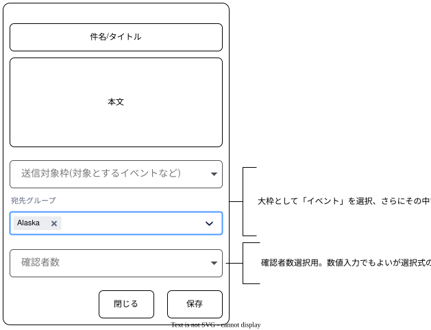
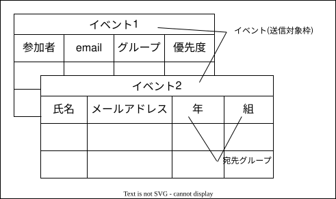

# 開発者メモ

## slack2mail

Slack画面からメールを送信する機能

会員などたくさんの人向けにメール送信する作業の負担を軽減するslackアプリ

- Slack画面上で操作できる
- あらかじめ登録したメール一覧から属性などで絞り込んで宛先とすることができる
- 複数人が確認したら送信される
- 承認から送信までインターバルがありその間に送信を中止することもできる
- 投稿したメールを修正できる
- メールを送る側からは宛先の個人情報がわからない(属性のみで選択のため)







## 構成

- Nuxt
- Supabase
- Google Auth
- ~~Cloudflare Pages~~ (※ Node.jsの機能に制限があり動かない部分があったため採用を見送り)
- Oracle Cloud (※ 上記理由によりフルでNodeが稼働する仮想マシン + Docker構成とした)

## Supabase 設定

### Supabaseの初期設定（クラウド側）

まずはSupabaseの公式サイトでプロジェクトを作成します。

1. Supabaseの公式サイトにアクセスし、GitHubアカウントなどでサインインします。
2. 「New Project」ボタンを押します。
3. 以下の情報を入力してプロジェクトを作成します。
    1. Name: 任意のプロジェクト名（例: my-nuxt-app）
    2. Database Password: データベースのパスワード（※忘れないようにメモしてください）
    3. Region: 日本に一番近い 「Tokyo (ap-northeast-1)」 を選択します。
    4. Pricing Plan: 「Free（無料）」 を選択します。
4. 作成完了まで数分待ちます。画面に「Project URL」と「APIの鍵（anon key）」が表示されたら、それらをコピーしておきます。

### Googleログインを使えるようにする（認証設定）

Googleでログインできるように、SupabaseとGoogleを繋ぎます。

1. Google Cloud Consoleで作成した Client ID と Client Secret を手元に用意します。
2. Supabaseの管理画面を開き、左メニューの「Authentication（認証）」➔「Providers」をクリックします。
3. 一覧から「Google」を探して開き、以下を設定します。
    1. Googleを「Enabled（有効）」にする。
    2. Client ID と Client Secret を入力する。
4. 画面に表示される「Redirect URL（https://supabase.co のようなURL）」をコピーします。
5. Google Cloud Consoleに戻り、「承認されたリダイレクトURI」に、今コピーしたSupabaseのURLを追加して保存します。

### リダイレクト先設定

Supabaseのデフォルト値をプロジェクトのドメインに変更する

1. Authentication - URL Configuration をクリック
2. URL Configuration画面のSite URLをプロジェクトのドメイン(https://app.example.com)に変更する

※ Nuxt側は @nuxtjs/supabase を使用します

## supabase

supabaseを使用した開発

### テーブルの管理

```
npm i -D supabase
npx supabase init
npx supabase migration new init_tables
```

```supabase/migrations/[タイムスタンプ]_init_tables.sql``` にテーブル定義を記載する

```
CREATE TABLE IF NOT EXISTS
    public.test_table (
        id UUID .....
    )

```

### 本番用supabaseプロジェクトとのリンク

```
npx supabase login
```
ブラウザが開くのでログイン

```
npx supabase link --project-ref <YOUR_SUPABASE_PROJECT\ID>
```

### Nuxt.js向け型定義作成
```
npx supabase gen types --lang=typescript --local > shared/types/database.types.ts
```

### 開発用supabase

#### 起動

```
npx supabase start
```

起動すると、ローカル専用の API URL や anon key、そして手元のブラウザで開けるローカル版のSupabaseダッシュボード（Studio）のURL（http://localhost:54323 など）がターミナルに出力されます。

停止は
```
npx supabase stop
```


#### Seed Data

テスト用の初期データを自動挿入

```
supabase/seed.sql
```

例
```
-- supabase/seed.sql の中身
INSERT INTO public.profiles (id, username) 
VALUES 
  ('00000000-0000-0000-0000-000000000001', 'test-user-1'),
  ('00000000-0000-0000-0000-000000000002', 'test-user-2');

```

#### データベース・テストデータ初期化

```
npx supabase db reset
```

#### OAuth設定

```supabase/config.toml```

```
[auth.external.google]
enabled = true
client_id = "env(NUXT_GOOGLE_CLIENT_ID)"
secret = "env(NUXT_GOOGLE_CLIENT_SECRET)"
skip_nonce_check = true  # ローカルでのGoogle認証に必要
```

## GitHub

### GitHub Actionsによる自動マイグレーション

#### Supabase

コードが main ブランチにプッシュされた際に、自動でSupabaseへテーブルを同期（db push）するCI/CDパイプラインを作成します。リポジトリ直下に .github/workflows/supabase-deploy.yml を作成し、以下の内容を記述します。


```
name: Deploy Database Migrations

on:
  push:
    branches:
      - main # 反映させたいメインブランチ名
    paths:
      - 'supabase/**' # supabaseフォルダに変更があった場合のみ実行

jobs:
  deploy:
    runs-on: ubuntu-latest
    steps:
      - uses: actions/checkout@v4

      - uses: supabase/setup-cli@v1
        with:
          version: latest

      - name: Deploy Migrations
        run: |
          supabase db push --project-ref ${{ secrets.SUPABASE_PROJECT_ID }} --password ${{ secrets.SUPABASE_DB_PASSWORD }}
```

#### OCI

1. GitHub Actions用のSSH鍵を準備する:  
  事前準備。  
  本番環境の仮想マシンにパスワードなしでSSH接続できるよう、専用のSSH鍵ペア（秘密鍵と公開鍵）を作成または既存のものを利用できるようにします。
- 検証方法: 手元の端末（または後述の設定）から、そのSSH鍵を使って仮想マシンにログインできることを確認します。

2. GitHubリポジトリにシークレットを設定する:
  ソースコードに含めたくない接続情報や秘密鍵を、GitHubのリポジトリ設定に登録します。
    1. GitHubのリポジトリ画面を開く。
    2. Settings ＞ Secrets and variables ＞ Actions の順に移動する。
    3. New repository secret をクリックし、以下の値をそれぞれ登録する。
        - HOST: 仮想マシンのIPアドレスまたはドメイン名
        - USERNAME: 仮想マシンのSSHユーザー名
        - SSH_PRIVATE_KEY: 仮想マシンにアクセスするための秘密鍵の中身
    4. 検証方法: 登録したシークレット名がリストに正しく表示されていることを確認する。

3. デプロイ用スクリプトを仮想マシン側に用意する:  
  仮想マシン側の設定。  
  本番環境のプロジェクトディレクトリ（例: /home/user/app）に移動し、Docker Composeを安全に更新できる状態にしておきます。
    - あらかじめ仮想マシン側で一度リポジトリをクローンし、環境変数ファイル（.env）などを配置しておいてください。
    - 検証方法: 仮想マシン上で手動で git pull と docker compose up -d --build を実行し、問題なくアプリが起動することを確認する。

4. GitHub Actionsのワークフローファイルを作成する:
  GitHubの設定。
  リポジトリのルートに .github/workflows/deploy.yml というファイルを作成し、以下の内容を記述します。

##### 仮想マシンでbuildするパターン

リポジトリのルートに .github/workflows/deploy.yml というファイルを作成し、以下の内容を記述します。

```
name: Deploy to Production

on:
  push:
    branches:
      - main  # mainブランチにプッシュされたときに実行

jobs:
  deploy:
    runs-on: ubuntu-latest
    steps:
      - name: Checkout code
        uses: actions/checkout@v4

      - name: Set up SSH key
        uses: webfactory/ssh-agent@v0.9.0
        with:
          ssh-private-key: ${{ secrets.SSH_PRIVATE_KEY }}

      - name: Deploy to Remote Server
        env:
          HOST: ${{ secrets.HOST }}
          USERNAME: ${{ secrets.USERNAME }}
        run: |
          ssh -o StrictHostKeyChecking=no $USERNAME@$HOST << 'EOF'
            # 実際のプロジェクトディレクトリへ移動
            cd /path/to/your/app

            # 最新のコードを取得
            git pull origin main

            # Dockerイメージのビルドとコンテナの再起動
            docker compose down
            docker compose up -d --build
          EOF
```

##### githubでbuildするパターン

1. GitHub Packagesへのプッシュ権限を設定する:  
  GitHub ActionsからGHCRへイメージを書き込めるようにするため、リポジトリの権限を確認します。
    1. リポジトリの Settings ＞ Actions ＞ General を開く。
    2. ページ下部の Workflow permissions で、Read and write permissions にチェックを入れて保存する。
    - 検証方法: 権限設定が保存されていることを確認する。

2. 仮想マシンからGHCRへログインできるようにする:  
  仮想マシン側の設定。  
  プライベートリポジトリを使用する場合や、パブリックでもダウンロード時に認証を行うため、仮想マシン側で一度だけログイン設定を行います。
      1. GitHubでアクセストークン（Personal Access Token: read:packages 権限が付与されたもの）を作成する。
      2. 仮想マシンにSSHログインし、以下のコマンドでログインする。
      ```
      echo "YOUR_PAT_TOKEN" | docker login ghcr.io -u YOUR_GITHUB_USERNAME --password-stdin
      ```
      - 検証方法: ログイン成功メッセージ（Login Succeeded）が表示されることを確認する。

3. ビルドとデプロイのワークフローを作成する


.github/workflows/deploy.yml

```
name: Build and Deploy

on:
  push:
    branches:
      - main

env:
  REGISTRY: ghcr.io
  IMAGE_NAME: ${{ github.repository }}

jobs:
  build-and-push:
    runs-on: ubuntu-latest
    permissions:
      contents: read
      packages: write

    steps:
      - name: Checkout code
        uses: actions/checkout@v4

      - name: Log in to the Container registry
        uses: docker/login-action@v3
        with:
          registry: ${{ env.REGISTRY }}
          username: ${{ github.actor }}
          password: ${{ secrets.GITHUB_TOKEN }}

      - name: Extract metadata (tags, labels)
        id: meta
        uses: docker/metadata-action@v5
        with:
          images: ${{ env.REGISTRY }}/${{ env.IMAGE_NAME }}
          tags: |
            type=raw,value=latest,enable={{is_default_branch}}

      - name: Build and push Docker image
        uses: docker/build-push-action@v5
        with:
          context: .
          push: true
          tags: ${{ steps.meta.outputs.tags }}
          labels: ${{ steps.meta.outputs.labels }}

  deploy:
    needs: build-and-push
    runs-on: ubuntu-latest
    steps:
      - name: Set up SSH key
        uses: webfactory/ssh-agent@v0.9.0
        with:
          ssh-private-key: ${{ secrets.SSH_PRIVATE_KEY }}

      - name: Deploy to Remote Server
        env:
          HOST: ${{ secrets.HOST }}
          USERNAME: ${{ secrets.USERNAME }}
        run: |
          ssh -o StrictHostKeyChecking=no $USERNAME@$HOST << 'EOF'
            cd /path/to/your/app

            # 最新のイメージをプルしてコンテナを更新
            docker compose pull
            docker compose up -d
          EOF
```

docker-compose.yml例
```
services:
  app:
    image: ghcr.io/your-github-username/your-repo-name:latest
    ports:
      - "80:80"
    environment:
      - KEY=VALUE
```

検証方法: ファイルを main ブランチにプッシュし、GitHubの「Actions」タブでワークフローがエラーなく緑色（成功）になることを確認する。

> セキュリティに関する注意点  
SSHのホスト鍵確認をスキップする設定（StrictHostKeyChecking=no）を使用しています。よりセキュアな環境を目指す場合は、known_hosts にホストのフィンガープリントを登録するアクション（例: appleboy/ssh-action など）の利用を検討してください。

### GitHub環境変数

GitHub リポジトリにシークレットを登録GitHub のリポジトリ設定（Settings > Secrets and variables > Actions）を開き、以下の2つの環境変数を登録します。

- SUPABASE_PROJECT_ID: SupabaseのプロジェクトID
- SUPABASE_DB_PASSWORD: プロジェクト作成時に設定したデータベースのパスワード

